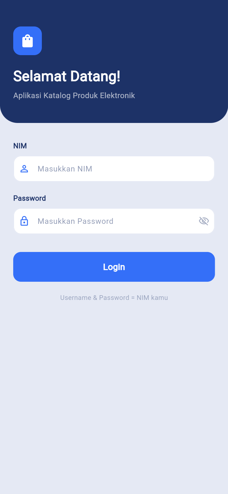
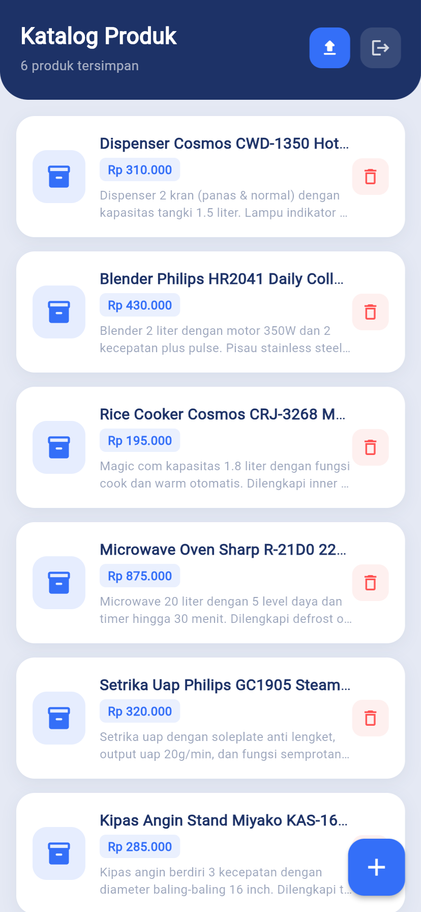
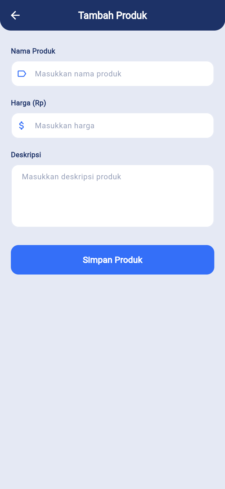
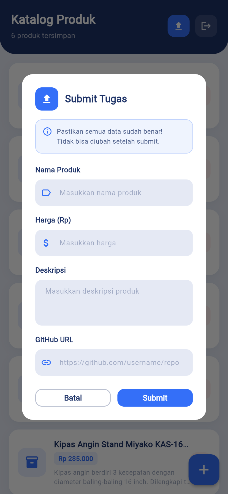

# 📱 Tugas Praktikum — Pemrograman Berbasis Mobile 2026

Aplikasi katalog produk elektronik berbasis Flutter yang terintegrasi dengan REST API menggunakan autentikasi Bearer Token.

---

## 👤 Identitas Mahasiswa

| Field | Detail |
|-------|--------|
| **Nama** | Atha Rifyan Adyfy |
| **NIM** | 242410103051 |
| **Kelas** | PBM (D) |
| **Mata Kuliah** | Pemrograman Berbasis Mobile |
| **Tahun** | 2026 |

---

## 📋 Deskripsi Aplikasi

Aplikasi ini merupakan **katalog produk elektronik** yang dibangun menggunakan Flutter. Pengguna dapat login menggunakan NIM, mengelola daftar produk elektronik (tambah & hapus), serta melakukan submit tugas ke server praktikum.

---

## ✨ Fitur Utama

- 🔐 **Login** menggunakan NIM & Password dengan Bearer Token Authentication
- 📦 **Lihat Daftar Produk** — menampilkan semua draft produk milik pengguna
- ➕ **Tambah Produk** — menyimpan produk baru ke server (draft)
- 🗑️ **Hapus Produk** — soft delete produk dari tampilan
- 📤 **Submit Tugas** — mengirimkan data produk beserta link GitHub ke server

---

## 🛠️ Teknologi yang Digunakan

- **Framework**: Flutter
- **Language**: Dart
- **HTTP Client**: package:http
- **Secure Storage**: flutter_secure_storage
- **API Base URL**: https://task.itprojects.web.id

---

## 🏗️ Struktur Project
```
lib/
├── main.dart
├── models/
│   └── product_model.dart
├── services/
│   └── api_service.dart
├── screens/
│   ├── login_screen.dart
│   ├── product_list_screen.dart
│   └── add_product_screen.dart
└── widgets/
    └── product_card.dart
```

---

## 📡 API Endpoint

| Method | Endpoint | Keterangan |
|--------|----------|------------|
| POST | `/api/auth/login` | Login & ambil token |
| GET | `/api/products` | Lihat daftar produk |
| POST | `/api/products` | Tambah produk baru |
| DELETE | `/api/products/{id}` | Hapus produk |
| POST | `/api/products/submit` | Submit tugas |

**Base URL:** `https://task.itprojects.web.id`

---

## 📸 Screenshot Aplikasi

### 1. Halaman Login


### 2. Halaman Utama — Daftar Produk


### 3. Form Tambah Produk


### 4. Form Submit Tugas


---

## 🚀 Cara Menjalankan Aplikasi

1. Clone repository ini
```bash
   git clone https://github.com/AthaRifyan/Tugas-PBM-API-2026.git
   cd Tugas-PBM-API-2026
```

2. Install dependencies
```bash
   flutter pub get
```

3. Jalankan aplikasi
```bash
   flutter run
```

4. Login menggunakan NIM sebagai username dan password

---

## 📦 Dependencies

```yaml
dependencies:
  flutter:
    sdk: flutter
  http: ^1.6.0
  flutter_secure_storage: ^10.2.0
```

---

## ⚠️ Catatan

- Seluruh request API menggunakan Bearer Token pada header Authorization
- Token disimpan secara aman menggunakan `flutter_secure_storage`
- Data produk bersifat draft dan hanya dapat dilihat oleh pemilik akun

---

> Tugas Praktikum Pemrograman Berbasis Mobile — 2026
